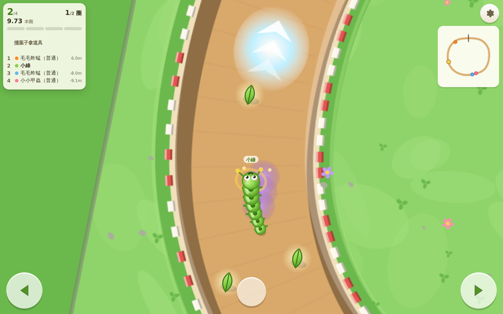
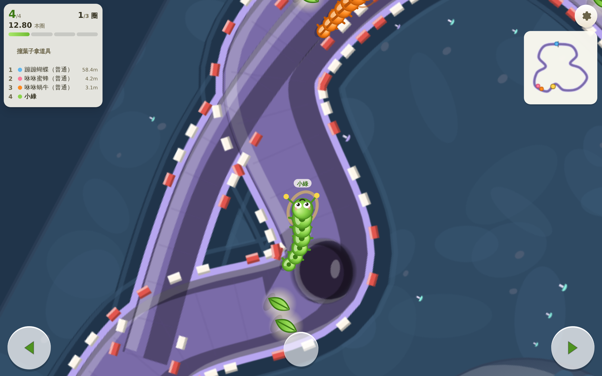
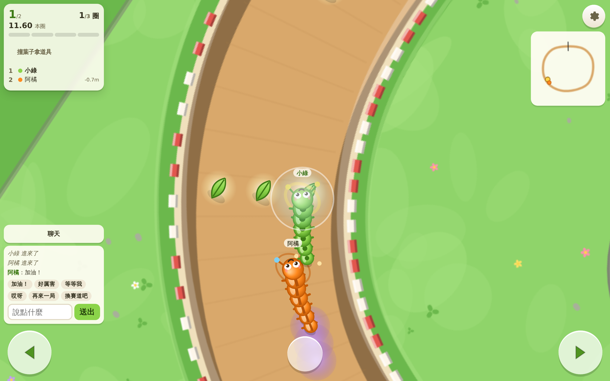
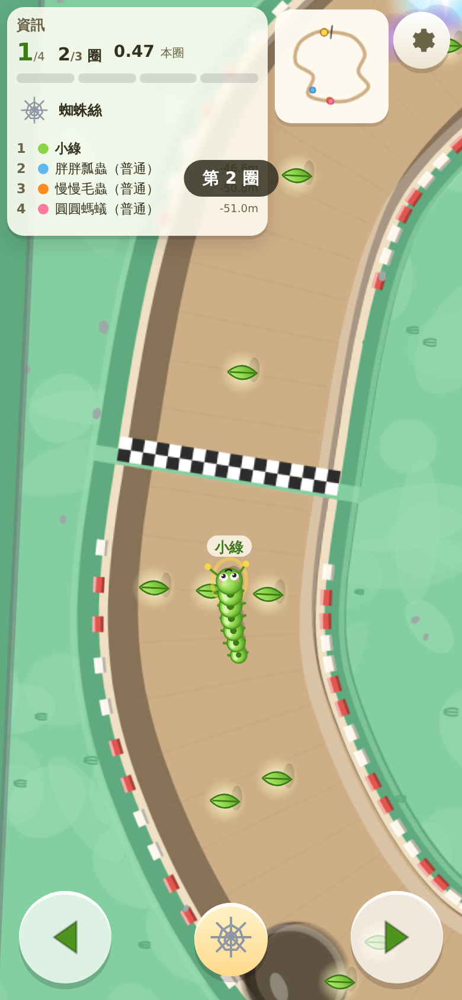
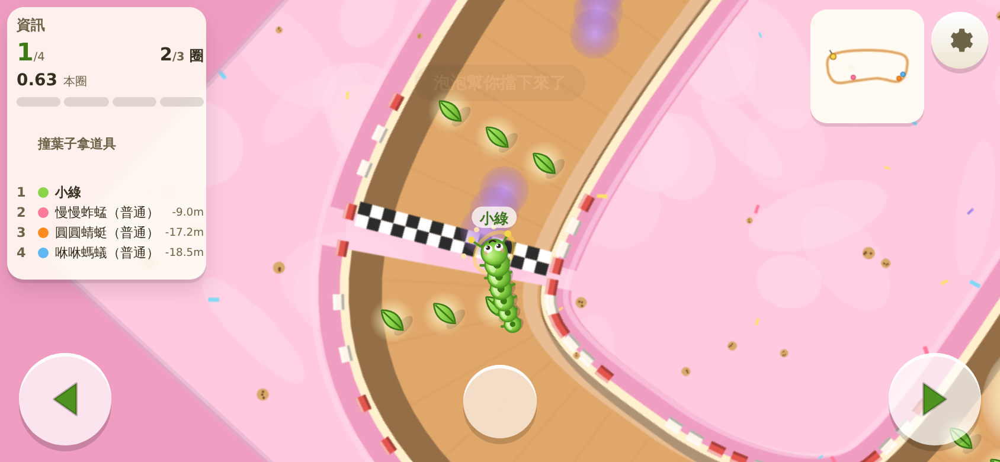

# 毛毛蟲賽車（caterpillar-race）

> **左右兩顆鍵，扭出速度。**
> 俯視視角的可愛賽車遊戲：八隻手繪毛毛蟲、六張賽道、蠕動衝刺、四段電腦對手，
> 以及最多六人同場的線上競速。整個專案**零依賴**，雙擊 `啟動遊戲.bat` 就能玩。

---

## 這款遊戲在玩什麼

毛毛蟲會自己一直往前蠕動，你**不用管油門**，只要做三件事：左轉、右轉、用道具。

真正的深度來自**蠕動衝刺**：真實的毛毛蟲靠身體左右波動前進，這裡也一樣。
左右**交替**按，而且每次換邊的間隔抓在**大約半秒**（0.18～0.55 秒），
蠕動槽就會一格一格亮起來；亮滿四格，毛毛蟲自動衝刺 1.2 秒、速度 +45%。

- 換邊太快（< 0.12 秒）＝亂按，直接歸零
- 換邊太慢（> 0.55 秒）＝洩氣，重新開始
- 扭身體會讓你偏離走線 → **長直線盡量扭，快進彎時要收手**

這就是整個遊戲的取捨，也是為什麼主角是毛毛蟲而不是車。



---

## 怎麼跑起來

### 最快的方式

雙擊 **`啟動遊戲.bat`**（會自己找 Node，包含 nvm-windows 裝的版本），
瀏覽器會開 <http://localhost:3070>。

### 用命令列

```bash
npm start          # 開伺服器（單機 ＋ 線上都能玩）
npm test           # 規則核心單元測試
npm run verify     # 全部驗收（規則／賽道／道具／電腦對手／美術／音訊／流程／線上）
```

只想玩單機的話，直接用瀏覽器打開 `public/index.html` 也可以，不需要 Node。

---

## 操作

| 動作 | 鍵盤 | 觸控 |
| --- | --- | --- |
| 左轉 | `←` 或 `A` | 左下角大圓鍵 |
| 右轉 | `→` 或 `D` | 右下角大圓鍵 |
| 用道具 | `空白鍵`／`Shift`／`↑`／`W` | 中間下方的道具鍵 |
| 暫停（單機） | `Esc` | — |
| 設定 | — | 右上角齒輪 |

---

## 內容

### 八隻毛毛蟲

小綠、阿橘、莓莓、藍波、小紫、奶油、薄荷、可可。
能力完全一樣，只差外觀。顏色與花紋**八隻都不重複**（`npm run verify` 會檢查
最接近的兩隻 RGB 距離仍大於 70），色彩輔助打開後還會再加上形狀標記。

### 六張賽道 ＋ 隨機賽道

| 賽道 | 難度 | 圈數 | 特色 |
| --- | --- | --- | --- |
| 花園小徑 | ★ | 2 | 寬敞好跑的入門賽道 |
| 菜園迷宮 | ★★ | 3 | 直角彎一個接一個 |
| 大樹枝幹 | ★★★ | 3 | 窄橋，還有一條捷徑 |
| 水窪淺灘 | ★★ | 3 | 泥巴和水窪特別多 |
| 糖果餅乾 | ★★★ | 3 | 長直線，蠕動衝刺天堂 |
| 夜光蘑菇 | ★★★★ | 3 | 路窄彎急，兩條捷徑 |

另外有「隨機賽道」：用 seed 現生一張閉環賽道，同一個 seed 一定長出同一張。

### 六種道具

**好道具**：果汁加速（3 秒 +55%，免疫減速地形）、泡泡護盾（6 秒擋一次）、葉子小飛（1.2 秒飄浮，無視地形）
**壞道具**：黏黏點點（身後留三攤黏液）、蜘蛛絲（黏住前面最近的人）、縮小咒（第一名縮小 4 秒）

名次越後面越容易抽到強力道具（橡皮筋分配）。
右上角設定可以關掉壞道具；**幼幼班本來就不會抽到**。

### 四段電腦對手

| 難度 | 速度上限 | 走線 | 道具 |
| --- | --- | --- | --- |
| 幼幼班 | 78% | 沿中線，誤差大 | 幾乎不用，不用負面；玩家落後太多時會放慢等人 |
| 簡單 | 86% | 常常過彎過頭 | 反應延遲 1.2 秒 |
| 普通 | 95% | 走理想線、吃加速帶 | 反應延遲 0.5 秒 |
| 困難 | 100% | 抄內線、走捷徑、閃黏液 | 反應延遲 0.15 秒 |

差異是**量得出來**的，不是只改名字：`npm run test:ai` 讓四段跑同一批賽道，
完成時間必須單調遞減、道具使用率必須遞增。

### 線上對戰

- 2～6 人同一條賽道，觀戰席上限 20 人
- 席位滿了或對局進行中進來會**自動轉觀戰並告訴你**，不會默默把觀戰者當成玩家
- 邀請連結有**範圍、有效期限（與房間同生命）與撤銷狀態**，房主可以隨時重發
- 房間左側是操作 Summary、左下是聊天室（有快捷短語與未讀數），賽道畫面盡可能大
- 對局中掉線會**幽靈化**（半透明、不擋路、位置保留），30 秒內重連可以回到原位；超時退賽
- 伺服器 30Hz 權威迴圈，前端做預測與平滑校正，誰贏誰輸一律以伺服器為準

---

## 立體感是怎麼做出來的

賽道不是平面色塊。光源固定在左上，每一張賽道都疊了四層：

1. **草地斷面**：跑道外圈一條深綠色帶，等於草皮被切開露出的側面
2. **草地上緣亮線**：斷面往光的方向推一點再描一次，像切口被照到
3. **路面內側投影**：把路面輪廓往光的反方向推去描粗線，再夾在路面裡 ——
   推出去的那半邊被夾掉，只剩「草牆投在路上」的那一半
4. **路面內側邊光**：同樣手法但往光的方向推，對面的斜坡受光

再加上彎道的紅白緣石、凹下去的泥巴水窪、有接地陰影與高光的石頭，
平面的俯視圖就會讀成「路面比草地低一階」。

毛毛蟲也是同一套：每一節都有徑向漸層、肚子的亮面、花紋、小腳與接地陰影。

| 花園小徑 | 夜光蘑菇 |
| --- | --- |
|  |  |

| 線上房間 | 線上對戰 |
| --- | --- |
|  |  |

| 手機直向 | 手機橫向 |
| --- | --- |
|  |  |

---

## 專案結構

```
caterpillar-race/
├── server.js                 HTTP ＋ WebSocket ＋ 身分
├── lib/
│   ├── ws.js                 自己寫的 WebSocket 伺服器（RFC 6455，所以零依賴）
│   ├── rooms.js              房間、席位、觀戰、邀請、聊天（純邏輯，不碰 socket）
│   ├── match-loop.js         30Hz 權威迴圈、快照廣播、心跳掃描
│   └── protocol.js           客戶端訊息 → 上面兩支；權限檢查都在這裡
├── public/
│   ├── index.html
│   ├── css/style.css
│   └── js/
│       ├── config.js         全站唯一的 server URL 入口
│       ├── rng.js            可注入種子的亂數
│       ├── rules.js          ★ 共用規則核心（瀏覽器與伺服器同一份）
│       ├── tracks.js         賽道幾何、地形網格、檢查點、隨機生成
│       ├── items.js          六種道具與橡皮筋分配
│       ├── ai.js             四段電腦對手
│       ├── render.js         Canvas 繪圖（賽道立體化、毛毛蟲）
│       ├── input.js          鍵盤 ＋ 左右觸控鍵
│       ├── audio.js          程序化 BGM 與音效（不依賴外部音檔）
│       ├── net.js            WebSocket、預測與校正
│       ├── online.js         大廳、房間、觀戰、邀請、聊天
│       ├── app.js            畫面流程與主迴圈
│       └── themes/           八隻毛毛蟲、六套賽道配色、隨機暱稱（純資料）
├── tests/verify.js           規則核心單元測試
├── scripts/                  各項驗收腳本
├── render.yaml               Render 免費方案部署設定
├── .github/workflows/        GitHub Pages 發佈
└── 啟動遊戲.bat               一鍵啟動
```

**規則核心共用**：`public/js/rules.js` 同時被瀏覽器與 `server.js` `require`，
單機、電腦對手、線上三種模式跑的是同一份物理、計圈與勝負判定，不會漂移。

---

## 驗收

```bash
npm run verify
```

| 項目 | 檢查什麼 |
| --- | --- |
| `tests/verify.js` | 物理、蠕動衝刺、計圈與檢查點、道具效果、勝負、重現性 |
| `scripts/track-check.js` | 六張賽道跑得完，120 個隨機 seed 都長得出可以跑的賽道 |
| `scripts/item-check.js` | 六種道具在真的一局裡會做該做的事 |
| `scripts/ai-check.js` | 四段電腦的差異量得出來（時間單調遞減） |
| `scripts/render-check.js` | 美術資產完整、顏色分得出來、沒有 emoji 文字美術 |
| `scripts/audio-check.js` | 音效齊全、沒有自動播放、首次手勢才解鎖 |
| `scripts/flow-check.js` | 程式抓的 id 都存在、每個畫面有回去的路、RWD、觸控命中區、server URL 沒寫死 |
| `scripts/online-check.js` | 真的開伺服器、真的連 WebSocket，走完開房到結算的完整流程 |

---

## 部署

### 伺服器（Render 免費方案）

`render.yaml` 已經寫好。匯入 repo 之後：

- Build Command：留空（零依賴）
- Start Command：`node server.js`
- Health Check Path：`/health`
- 環境變數 `ALLOW_ORIGIN`：填前端網址，例如 `https://pjh-eric.github.io`

免費方案會休眠，第一個人進來要等 30～60 秒冷啟動，前端會顯示「伺服器可能在睡覺，正在叫醒它…」並自動重試。
房間狀態視為可清理的暫時狀態，不存磁碟，服務重啟不會留下垃圾。

### 前端（GitHub Pages）

`.github/workflows/pages.yml` 會在推到 `main` 時跑完整驗收再發佈。
先到 **Settings → Secrets and variables → Actions → Variables** 新增 `GAME_SERVER_URL`，
值填 Render 上的網址；建置時會由 `scripts/inject-server-url.js` 注入 `config.js`。

沒有設也能發，只是前端只能玩單機。

### server URL 規則

前端連線位置**只從 `public/js/config.js` 來**，解析優先序：

1. 網址參數 `?server=https://example.com`
2. 建置時注入的 `GAME_SERVER_URL`
3. 頁面本身就是伺服器發出來的 → 同源
4. 都沒有 → 只能玩單機

**不做 localhost 回退**，不寫死任何平台網址，秘密不進前端 bundle。
WebSocket 網址由 `Config.toWs()` 換算（http→ws、https→wss），不用字串替換猜協定。

---

## 本機埠號

| 遊戲 | 埠號 |
| --- | --- |
| 其他小遊戲 | 3000／3010／3020／3030／3040／3050／3060／3090 |
| **毛毛蟲賽車** | **3070** |

---

## 還沒做的事

- 正式的美術與音訊資產（目前全部是程式手繪的向量圖形與程序化合成音）
- 伺服器排行榜（免費方案沒有可靠的持久化，目前只存本機紀錄）
- 遊戲手把支援（只做鍵盤與觸控）
- 多語言（只做繁體中文）

## 授權

MIT
